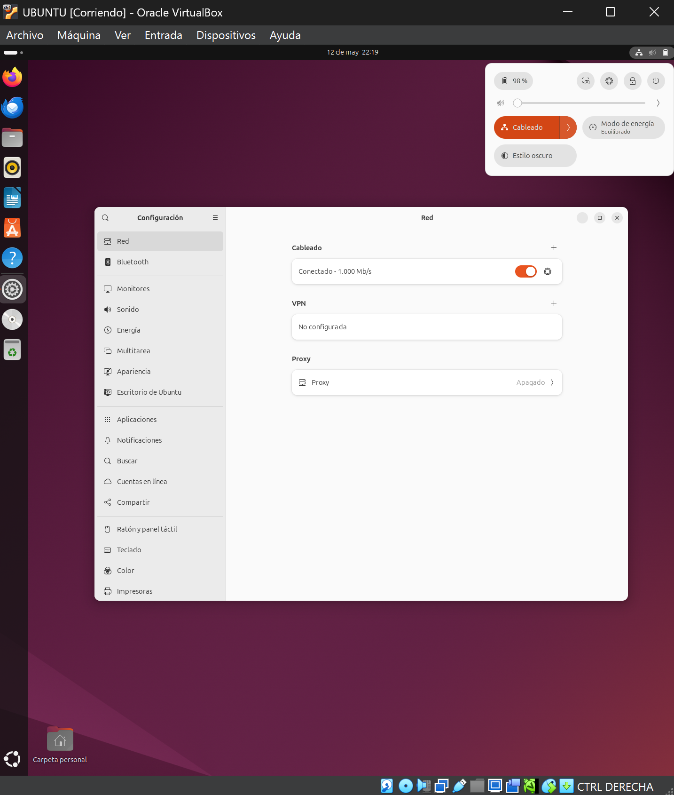

# CONFIGURACIÓN UBUNTU DESKTOP

**UT7 - SO LINUX Administración y Configuración**  

**Módulo:** Sistemas Informáticos  
**Departamento:** Informática y Comunicaciones  
**Alumno/a:**  Damián Quílez Mesa 
**Fecha:** Mayo-2025  
**Curso:** 2024/2025  
**GRUPO:** 1º DAM 

---

## Tareas de Configuración
**Ej1:** Accede a la configuración del sistema y comprueba la interfaz Inalámbrica del mismo para ver si 
tienes accesible un adaptador inalámbrico en la máquina instalada.

En la siguiente imagen vemos como desde la configuración no aparece ningún adaptador inalámbrico, por lo que damos por hecho que no está accesible

---

**Ej2:** Modifica el fondo de escritorio y la pantalla de bloqueo de tu sistema. Puedes usar las  imágenes, colores o formas que desees. 

Desde Configuración/Apariencia permite cambiar el fondo, en este caso le ponemos el mismo fondo pero de color negro, en esta versión de Ubuntu a diferencia de versiones anteriores no permite cambiar el fondo de la pantalla de bloqueo.

---

**Ej3: **Modifica el Dock para que los iconos se vean a la derecha y con un tamaño menor del que tiene  inicialmente. 

Yendo a Configuración/Escritorio de Ubuntu modificamos la posición del dock a la derecha y disminuimos el tamaño de los iconos a 34.

---

**Ej4:** Bloquea las notificaciones de la pantalla de bloqueo. 

En Configuración/Privacidad y Seguridad simplemente desactivamos las notificaciones dándole al botón que viene activado por defecto.

---

**Ej5: **Si no lo tienes ya configurado previamente, haz que tu sistema esté completamente en español  teniendo como idioma “Español (España)” y como fuente de entrada (teclado) Español.

En Configuración/Sistema vemos que todo está en Español.

También en Configuración/Teclado comprobamos si la fuente de entrada está en Español.

---

**Ej6: **Muestra de forma continua el menú de “Acceso Universal”, ¿qué cambio se produce en el  sistema? A continuación, modifica algunos de los efectos visuales para comprobar que  efectivamente se aplican.

En primer lugar activamos el icono en Configuración/Accesibilidad, ahora podemos ver un pequeño icono arriba a la derecha que antes no aparecía.

Al hacer clic sobre este icono aparece un desplegable, en este caso para probar que funciona probamos la opción de "Texto grande" y vemos como respecto a la imagen anterior, efectivamente el texto se agranda.

---

**Ej7: **Modifica las opciones de Energía para apagar la pantalla cuando pasen 5 minutos de no  utilización de la misma. 

Para este apartado vamos a Configuración/Energía y vemos que la opción de apagar pantalla viene activada por defecto en 5 minutos por lo que no es necesario hacer nada.

---

**Ej8: **Comprueba que la fecha y hora del sistema se establece de forma automática y que la zona  horaria es adecuada estando ubicada en Madrid. 

Desde Configuracion/Sistema podemos apreciar que tanto la fecha como la hora están automatizadas y que la zona horaria es la pedida.

---

## Actualizaciones

**Ej1:  **Realiza la comprobación de actualizaciones desde la aplicación “Actualización de       Software”. No instales actualizaciones. 

En este caso al realizar la instalación de la máquina virtual se me actualizó, pero lo que debería de aparecer en el caso de que no lo hubiese actualizado sería algo como lo que vemos en la imagen pero donde nos notificaría que hay actualizaciones disponibles.

---

**Ej2: **Comprueba desde los comandos adecuados que tanto el sistema como el software  está actualizado. Si no es así, actualízalo desde la consola de comandos.

Con los siguientes comandos se actualizaría el software y el sistema.

---

**Ej3: ** Vuelve a realizar la comprobación de actualizaciones desde “Actualización de Software”.  ¿Seguimos teniendo actualizaciones pendientes?

En este punto, al haber realizado las actualizaciones debería aparecer algo como esto:

---

**Ej4: **Accede a la Configuración (Acerca de…) y pulsa para comprobar si hay o no  actualizaciones pendientes del sistema.

Pese a que en versiones anteriores de Ubuntu permitía comprobar si había actualizaciones disponibles en este caso no nos lo permite, para ver la parte de configuración "Acerca de" iremos a Configuracion/Sistema/Acerca de

---

**Ej5: **Comprueba el/los ficheros donde se realizan las actualizaciones el sistema. Es decir, desde  los repositorios que se realizan. Comenta brevemente alguna de las actualizaciones que  encuentres en el fichero. 

En este caso vemos el contenido del fichero sources.list.d, en el encontramos los repositorios online de donde se obtienen las actualizaciones.

Este archivo es el sources.list original, vemos que el contenido que tenia, se ha movido a un directorio que contiene ahora 2 archivos.

---

## Gestión de Usuarios

---

**Ej1: **Crea un nuevo usuario llamado “UsuarioSistemas” y asígnale la contraseña que quieras  (la  tendrás que recordar). 

Para poder crear un usuario necesitamos autenticarnos, lo hacemos con mi usuario

Creamos el usuario "UsuarioSistemas" al que le damos una contraseña

---

**Ej2: **Realiza un cambio de usuario entre el inicial del sistema (inicio) y el usuario que has  creado       anteriormente. 

Iniciamos sesión en el usuario introduciendo la contraseña

---

**Ej3: **Comprueba en el fichero donde quedan registrados los usuarios, que el usuario creado  en apartado 1 efectivamente existe. 

Con el siguiente comando podemos buscar en el fichero etc/passwd al usuario por su nombre, en este caso podemos ver que efectivamente aparece

---

**Ej4: **Cambia al usuario root para tener acceso total al sistema  

Ya que nuestro nuevo usuario no tiene permisos de administrador nos tenemos que ir a nuestro usuario administrador primero, una vez estemos nos pasamos al usuario raíz con el comando sudo su root.

---

**Ej5: **Vuelve a tu usuario, y finalmente apaga el equipo.

Aqui vemos que ya nos hemos logueado de nuevo en mi usuario

Para apagar hacemos clic arriba a la derecha, y en el desplegable buscamos la opcion de apagar.

___

